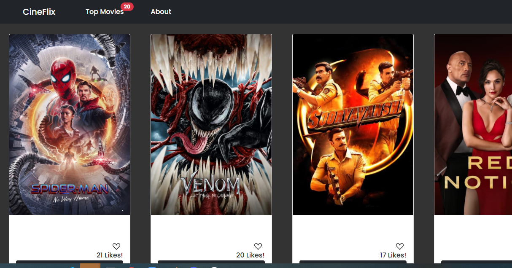
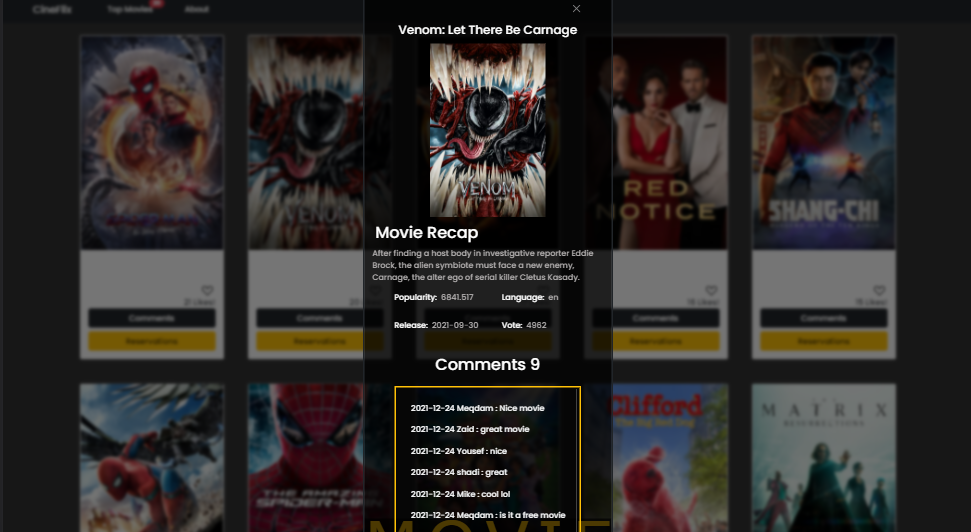
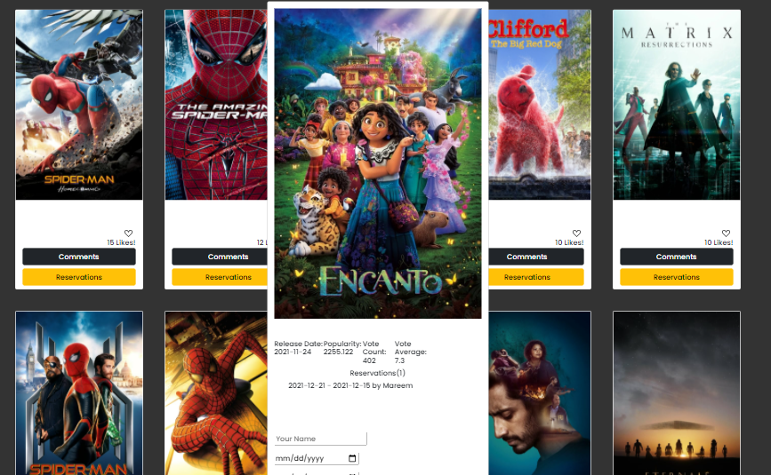

# CineFlix Project

> Website that represents the latest update on top movie API 
> with the ability to comment and make reservations on each one of
> the top movies

Additional description of the project and its features.
Microverse project series: CineFlix Project features will be here.

# Home page

# Popup 

# Reservation 

## Built With

- HTML5 
- SCSS
- Javascript
- Bootstrap 5
- Webpack 5
- API

## Live Demo

You can check the link below for the live demo.
https://meqdamalqudah.github.io/CineFlix/#

## Video description
[N/A](https://www.loom.com/share/3956c4234e0043ef81fbaae9d4f3a300)

## Getting Started

To get a local copy up and running follow these simple example steps.

### Setup
- Simply clone the project (for more information please check the link https://docs.github.com/en/repositories/creating-and-managing-repositories/cloning-a-repository
- Run the cmd promt
- Type "npm install" for the dependencies

### Install

you just have to select the green button code from github page then download zip files
and you will have our code source then you have to run npm start using cmd
or you can just check our live demo

## Authors

👤 **Evren Ersoy**

- GitHub: [https://github.com/Ewoskyx]
- Twitter: [https://twitter.com/Ewoskyx]
- LinkedIn: [https://www.linkedin.com/in/evren-ersoy-206510179/]

👤 **Laxmi Basnet**

- GitHub: [https://github.com/basnetlaxmi]
- Twitter: [https://twitter.com/basnet_luxmee]
- LinkedIn: [https://np.linkedin.com/in/laxmi-basnet-b22403131]

👤 **Meqdam Al-qudah**

- GitHub: [https://github.com/MeqdamAlqudah]
- Twitter: [https://twitter.com/MeqdamQudah]
- LinkedIn: [www.linkedin.com/in/meqdam-al-qudah-7514a21b5]

## Show your support

Give a ⭐️ if you like this project!

## Acknowledgments

- API that we used : https://developers.themoviedb.org/3/getting-started/introduction

## 📝 License
This project is [MIT](./MIT.md) licensed.